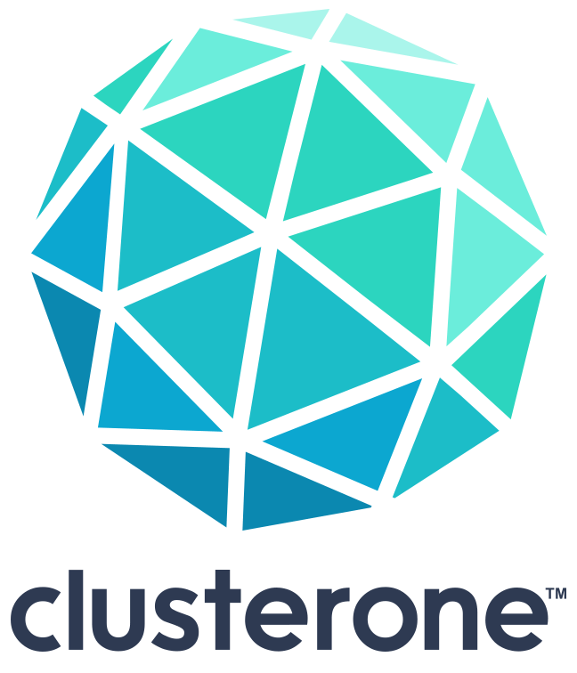

# DCGAN on Clusterone
<p align="center">

<br>
<br>
<a href="https://slackin-altdyjrdgq.now.sh"></a>
</p>

This is a TensorFlow implementation of a Deep Convolutional Generative Adversarial Network. The project uses the [celebA](http://mmlab.ie.cuhk.edu.hk/projects/CelebA.html) dataset to create artificial celebrity faces. The [original repository](https://github.com/carpedm20/DCGAN-tensorflow) has been adapted to help you get started with the [Clusterone](https://clusterone.com) deep learning computation platform.


The implementation is based on [this paper](http://arxiv.org/abs/1511.06434). The Torch code referenced in the paper can be found [here](https://github.com/soumith/dcgan.torch).

This Readme provides instructions to run this DCGAN on Clusterone. For more information, check out the [Clusterone documentation](https://docs.clusterone.com/v1.0/docs/creating-celebrity-faces-using-a-dcgan) for this example. 


## Table of Contents

- [Install](#install)
- [Usage](#usage)
- [More Info](#more-info)
- [License](#license)

## Install

To run this project, you need:

- [Python](https://python.org/) 3.5 or higher.
- [Git](https://git-scm.com/)
- The Clusterone Python library. Install it with `pip install clusterone`
- A Clusterone account. [Sign up](https://clusterone.com) for free if you don't have an account yet.

### Create the dataset

This example uses a small subset of the celebA dataset containing 1000 images to reduce file transfer times. You can of course also use the entire dataset. However, be aware that the dataset is large and may take a long time to upload to the Clusterone server.

1. Download the reduced dataset [here](https://tensorport-public-datasets.s3.amazonaws.com/celebA_small.zip). Unzip the downloaded file and `cd` into the directory with the data.
2. Create a Git repository from the data with `git init`.
3. Add and commit the data with `git add .` followed by `git commit -m "Initial commit"`
2. Log into your Clusterone account using `just login`.
5. Then create a new dataset with `just create dataset celeba-small`.
6. Link the local repository to the Clusterone dataset with  `just ln dataset -p celeba-small`.
4. Upload the dataset to your Clusterone account with `git push clusterone master`.

### Get the code ready

Clone this repository to your local machine.

Open [main.py](/main.py) and change the flag at the top of the script to their appropriate value:

1. `CLUSTERONE_USERNAME`: Your Clusterone username. This should be something like `johndoe`, not your email address!
2. `ROOT_PATH_TO_LOCAL_DATA`: The path to the dataset on your local machine.
3. `LOCAL_REPO`: The name of the local repository. 

### Create the project

Open a command line and `cd` into the root folder of the repository. Create a new project with `just init project dcgan-demo`.

Push the project code to Clusterone with `git push clusterone master`. The project is now uploaded to your Clusterone account.

## Usage

Use the following command to create a job on Clusterone.

```shell
just create job single --name 1-GPU-small-dataset --project dcgan-demo \ 
--datasets celeba-small --framework-version 1.0.0 --time-limit 1h
```

Now run the job with the following command:

```bash
just start job -p dcgan-demo/1-GPU-small-dataset
```

You can monitor the execution of your job on Clusterone using `just watch`.

Instead of running the model from the command line, you can also use Clusterone's graphical web interface [Matrix](https://clusterone.com/matrix).

## More Info

For more information and further reading, check out [Brandon Amos](http://bamos.github.io/)'s [blog post](http://bamos.github.io/2016/08/09/deep-completion/) and [image completion code](https://github.com/bamos/dcgan-completion.tensorflow) based on the original repository.

The purpose of this fork is to teach you how to run DCGAN on ClusterOne. For more information about what you can do with the project code, make sure to have a look at the [original Github repository](https://github.com/carpedm20/DCGAN-tensorflow).

## License

[MIT](LICENSE) © [Original repository](https://github.com/tensorport/DCGAN-tensorflow) by [Taehoon Kim](http://carpedm20.github.io/), modifications by Clusterone Inc.

[celebA](http://mmlab.ie.cuhk.edu.hk/projects/CelebA.html) dataset by Ziwei Liu, Ping Luo, Xiaogang Wang, Xiaoou Tang from the [Multimedia Laboratory](http://mmlab.ie.cuhk.edu.hk/) of The Chinese University of Hong Kong
